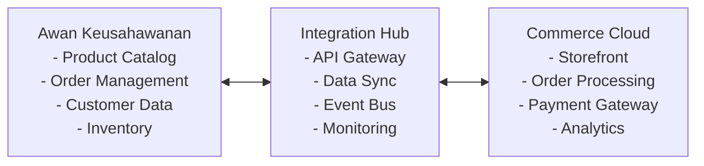

# Awan Keusahawanan Commerce Cloud Integration Architecture

## Overview

This document outlines the integration architecture between Awan Keusahawanan and major Commerce Cloud platforms to enable seamless eCommerce operations, data synchronization, and business scalability.

## Supported Commerce Cloud Platforms

- **SAP Commerce Cloud (Hybris)**
- **Salesforce Commerce Cloud (SFCC)**
- **Adobe Commerce Cloud (Magento)**
- **Oracle Commerce Cloud (OCC)**

## Architecture Overview



## Authentication & Security

### Supported Authentication Methods

| Platform | Primary Auth | Secondary Auth | API Keys |
|----------|-------------|----------------|----------|
| SAP Commerce Cloud | OAuth 2.0 | Basic Auth | ✓ |
| Salesforce Commerce Cloud | OAuth 2.0 | SAML 2.0 | ✓ |
| Adobe Commerce Cloud | OAuth 2.0 | Token-based | ✓ |
| Oracle Commerce Cloud | OAuth 2.0 | JWT | ✓ |

### Security Implementation

```typescript
// Authentication Configuration
interface AuthConfig {
  platform: 'sap' | 'salesforce' | 'adobe' | 'oracle';
  authType: 'oauth2' | 'saml' | 'apikey';
  credentials: {
    clientId: string;
    clientSecret: string;
    scope?: string;
    tokenUrl: string;
  };
  security: {
    tlsVersion: '1.2' | '1.3';
    encryption: 'AES-256';
    rbac: boolean;
  };
}
```

## Core Integration Modules

### 1. Product Information Management (PIM)

**Data Flow**: Awan Keusahawanan → Commerce Cloud

```typescript
interface ProductSync {
  productId: string;
  sku: string;
  name: string;
  description: string;
  price: {
    base: number;
    currency: string;
    discounted?: number;
  };
  inventory: {
    quantity: number;
    status: 'in_stock' | 'out_of_stock' | 'backorder';
  };
  attributes: Record<string, any>;
  categories: string[];
  images: string[];
  lastModified: Date;
}
```

### 2. Order Management System (OMS)

**Data Flow**: Bidirectional

```typescript
interface OrderSync {
  orderId: string;
  customerId: string;
  status: 'pending' | 'confirmed' | 'shipped' | 'delivered' | 'cancelled';
  items: OrderItem[];
  shipping: ShippingInfo;
  payment: PaymentInfo;
  totals: OrderTotals;
  timestamps: {
    created: Date;
    updated: Date;
    shipped?: Date;
    delivered?: Date;
  };
}
```

### 3. Customer Data Synchronization

```typescript
interface CustomerSync {
  customerId: string;
  profile: {
    email: string;
    firstName: string;
    lastName: string;
    phone?: string;
  };
  addresses: Address[];
  preferences: CustomerPreferences;
  segmentation: string[];
  loyaltyPoints?: number;
  lastActivity: Date;
}
```

### 4. Payment & Invoicing Integration

```typescript
interface PaymentSync {
  transactionId: string;
  orderId: string;
  amount: number;
  currency: string;
  method: 'credit_card' | 'paypal' | 'bank_transfer' | 'digital_wallet';
  status: 'pending' | 'completed' | 'failed' | 'refunded';
  gateway: string;
  invoiceId?: string;
  reconciliationData: Record<string, any>;
}
```

## Integration Patterns

### 1. API-Based Integration (Real-time)

```typescript
// REST API Implementation
class CommerceCloudAPI {
  async syncProduct(product: ProductSync): Promise<void> {
    const endpoint = this.getEndpoint('products');
    await this.httpClient.post(endpoint, product);
  }
  
  async getOrder(orderId: string): Promise<OrderSync> {
    const endpoint = this.getEndpoint(`orders/${orderId}`);
    return await this.httpClient.get(endpoint);
  }
}

// GraphQL Implementation (Adobe Commerce)
const SYNC_PRODUCT_MUTATION = `
  mutation SyncProduct($input: ProductInput!) {
    createProduct(input: $input) {
      id
      sku
      status
    }
  }
`;
```

### 2. Event-Driven Integration (Asynchronous)

```typescript
// Webhook Handler
interface WebhookEvent {
  eventType: 'order.created' | 'order.updated' | 'product.updated';
  timestamp: Date;
  data: any;
  source: string;
}

class EventHandler {
  async handleOrderCreated(event: WebhookEvent): Promise<void> {
    const order = event.data as OrderSync;
    await this.orderService.processOrder(order);
    await this.inventoryService.updateStock(order.items);
  }
}
```

### 3. Batch/ETL Pipelines

```typescript
// Batch Sync Configuration
interface BatchConfig {
  schedule: string; // cron expression
  batchSize: number;
  retryAttempts: number;
  dataTypes: ('products' | 'orders' | 'customers')[];
}

class BatchProcessor {
  async processBatch(config: BatchConfig): Promise<void> {
    const data = await this.extractData(config.dataTypes);
    const transformed = await this.transformData(data);
    await this.loadData(transformed);
  }
}
```

## Commerce Cloud-Specific Implementation

### SAP Commerce Cloud (Hybris)

```typescript
// OCC REST API Integration
class SAPCommerceIntegration {
  private baseUrl = 'https://api.commerce.sap.com/v2';
  
  async syncProduct(product: ProductSync): Promise<void> {
    const endpoint = `${this.baseUrl}/products`;
    const sapProduct = this.transformToSAPFormat(product);
    await this.apiClient.post(endpoint, sapProduct);
  }
  
  private transformToSAPFormat(product: ProductSync): any {
    return {
      code: product.sku,
      name: product.name,
      description: product.description,
      price: {
        value: product.price.base,
        currencyIso: product.price.currency
      },
      stock: {
        stockLevel: product.inventory.quantity
      }
    };
  }
}
```

### Salesforce Commerce Cloud (SFCC)

```typescript
// OCAPI Integration
class SalesforceCommerceIntegration {
  private baseUrl = 'https://instance.demandware.net/s/site/dw/shop/v21_3';
  
  async syncOrder(order: OrderSync): Promise<void> {
    const endpoint = `${this.baseUrl}/orders`;
    const sfccOrder = this.transformToSFCCFormat(order);
    await this.apiClient.post(endpoint, sfccOrder);
  }
}
```

### Adobe Commerce Cloud (Magento)

```typescript
// GraphQL Integration
class AdobeCommerceIntegration {
  private graphqlEndpoint = 'https://instance.adobe.commerce/graphql';
  
  async syncCustomer(customer: CustomerSync): Promise<void> {
    const mutation = `
      mutation {
        createCustomer(input: {
          email: "${customer.profile.email}"
          firstname: "${customer.profile.firstName}"
          lastname: "${customer.profile.lastName}"
        }) {
          customer {
            id
            email
          }
        }
      }
    `;
    await this.graphqlClient.request(mutation);
  }
}
```

### Oracle Commerce Cloud (OCC)

```typescript
// REST API Integration
class OracleCommerceIntegration {
  private baseUrl = 'https://instance.oraclecloud.com/ccstore/v1';
  
  async updateInventory(productId: string, quantity: number): Promise<void> {
    const endpoint = `${this.baseUrl}/products/${productId}/inventory`;
    await this.apiClient.put(endpoint, { quantity });
  }
}
```

## Scalability & Extensibility

### Multi-Store Configuration

```typescript
interface StoreConfig {
  storeId: string;
  platform: 'sap' | 'salesforce' | 'adobe' | 'oracle';
  locale: string;
  currency: string;
  timezone: string;
  endpoints: {
    products: string;
    orders: string;
    customers: string;
  };
}

class MultiStoreManager {
  private stores: Map<string, StoreConfig> = new Map();
  
  async syncAcrossStores(data: any, storeIds: string[]): Promise<void> {
    const promises = storeIds.map(storeId => {
      const config = this.stores.get(storeId);
      return this.syncToStore(data, config);
    });
    await Promise.all(promises);
  }
}
```

### Microservices Architecture

```typescript
// Service Registry
interface ServiceConfig {
  name: string;
  version: string;
  endpoints: string[];
  healthCheck: string;
  dependencies: string[];
}

class ServiceRegistry {
  private services: Map<string, ServiceConfig> = new Map();
  
  registerService(config: ServiceConfig): void {
    this.services.set(config.name, config);
  }
  
  async getHealthyService(serviceName: string): Promise<string> {
    const config = this.services.get(serviceName);
    // Return healthy endpoint
    return config.endpoints[0];
  }
}
```

## Error Handling & Monitoring

### Retry Mechanism

```typescript
class RetryHandler {
  async executeWithRetry<T>(
    operation: () => Promise<T>,
    maxRetries: number = 3,
    backoffMs: number = 1000
  ): Promise<T> {
    for (let attempt = 1; attempt <= maxRetries; attempt++) {
      try {
        return await operation();
      } catch (error) {
        if (attempt === maxRetries) throw error;
        await this.delay(backoffMs * Math.pow(2, attempt - 1));
      }
    }
  }
  
  private delay(ms: number): Promise<void> {
    return new Promise(resolve => setTimeout(resolve, ms));
  }
}
```

### Dead Letter Queue

```typescript
interface FailedMessage {
  id: string;
  originalMessage: any;
  error: string;
  attempts: number;
  timestamp: Date;
  nextRetry: Date;
}

class DeadLetterQueue {
  async addFailedMessage(message: any, error: string): Promise<void> {
    const failedMessage: FailedMessage = {
      id: generateId(),
      originalMessage: message,
      error: error,
      attempts: 1,
      timestamp: new Date(),
      nextRetry: new Date(Date.now() + 60000) // 1 minute
    };
    await this.storage.save(failedMessage);
  }
}
```

### Monitoring Dashboard

```typescript
interface MetricData {
  timestamp: Date;
  metric: string;
  value: number;
  tags: Record<string, string>;
}

class MonitoringService {
  async recordMetric(name: string, value: number, tags?: Record<string, string>): Promise<void> {
    const metric: MetricData = {
      timestamp: new Date(),
      metric: name,
      value,
      tags: tags || {}
    };
    await this.metricsStore.save(metric);
  }
  
  async getAPIHealth(): Promise<Record<string, boolean>> {
    const services = ['products', 'orders', 'customers', 'payments'];
    const health: Record<string, boolean> = {};
    
    for (const service of services) {
      health[service] = await this.checkServiceHealth(service);
    }
    
    return health;
  }
}
```

## Data Flow Diagrams

### Order Processing Flow

```
Customer Places Order (Commerce Cloud)
           ↓
    Webhook Notification
           ↓
    Awan Keusahawanan Receives Order
           ↓
    Inventory Check & Reserve
           ↓
    Payment Processing
           ↓
    Order Confirmation → Commerce Cloud
           ↓
    Fulfillment Process
           ↓
    Shipping Updates → Commerce Cloud
           ↓
    Delivery Confirmation
```

### Product Sync Flow

```
Product Updated (Awan Keusahawanan)
           ↓
    Change Detection
           ↓
    Data Transformation
           ↓
    Multi-Store Distribution
           ↓
    Commerce Cloud APIs
           ↓
    Sync Confirmation
           ↓
    Error Handling (if needed)
```

## Deployment Guidelines

### Cloud-Native Deployment

```yaml
# docker-compose.yml
version: '3.8'
services:
  integration-hub:
    image: awan-integration:latest
    environment:
      - NODE_ENV=production
      - REDIS_URL=${REDIS_URL}
      - DATABASE_URL=${DATABASE_URL}
    ports:
      - "3000:3000"
    depends_on:
      - redis
      - postgres
  
  redis:
    image: redis:7-alpine
    ports:
      - "6379:6379"
  
  postgres:
    image: postgres:15-alpine
    environment:
      POSTGRES_DB: integration
      POSTGRES_USER: ${POSTGRES_USER}
      POSTGRES_PASSWORD: ${POSTGRES_PASSWORD}
```

### Kubernetes Deployment

```yaml
# k8s-deployment.yml
apiVersion: apps/v1
kind: Deployment
metadata:
  name: integration-hub
spec:
  replicas: 3
  selector:
    matchLabels:
      app: integration-hub
  template:
    metadata:
      labels:
        app: integration-hub
    spec:
      containers:
      - name: integration-hub
        image: awan-integration:latest
        ports:
        - containerPort: 3000
        env:
        - name: DATABASE_URL
          valueFrom:
            secretKeyRef:
              name: db-secret
              key: url
```

### Serverless Deployment (AWS Lambda)

```typescript
// serverless.yml
service: awan-commerce-integration

provider:
  name: aws
  runtime: nodejs18.x
  region: us-east-1
  environment:
    DATABASE_URL: ${env:DATABASE_URL}
    REDIS_URL: ${env:REDIS_URL}

functions:
  syncProduct:
    handler: handlers/product.sync
    events:
      - http:
          path: /sync/product
          method: post
  
  processOrder:
    handler: handlers/order.process
    events:
      - http:
          path: /webhook/order
          method: post
```

## API Schema Mappings

### Awan Keusahawanan → SAP Commerce Cloud

```typescript
const sapMapping = {
  'product.sku': 'code',
  'product.name': 'name',
  'product.price.base': 'price.value',
  'product.price.currency': 'price.currencyIso',
  'product.inventory.quantity': 'stock.stockLevel',
  'product.categories': 'catalogVersion.categories'
};
```

### Awan Keusahawanan → Salesforce Commerce Cloud

```typescript
const sfccMapping = {
  'product.sku': 'id',
  'product.name': 'name',
  'product.price.base': 'price',
  'product.inventory.quantity': 'inventory.allocation',
  'product.description': 'short_description'
};
```

## Getting Started

1. **Environment Setup**
   ```bash
   npm install
   cp .env.example .env.local
   # Configure your Commerce Cloud credentials
   ```

2. **Database Migration**
   ```bash
   npx prisma migrate dev
   npx prisma generate
   ```

3. **Start Integration Services**
   ```bash
   npm run dev
   ```

4. **Configure Webhooks**
   - Set up webhook endpoints in your Commerce Cloud platform
   - Point to: `https://your-domain.com/webhook/{platform}`

5. **Test Integration**
   ```bash
   npm run test:integration
   ```

## Support & Maintenance

- **Documentation**: [Integration Docs](./docs/integration/)
- **API Reference**: [API Docs](./docs/api/)
- **Troubleshooting**: [Common Issues](./docs/troubleshooting.md)
- **Support**: integration-support@awan-keusahawanan.com

## License

This integration architecture is proprietary to Awan Keusahawanan. All rights reserved.
